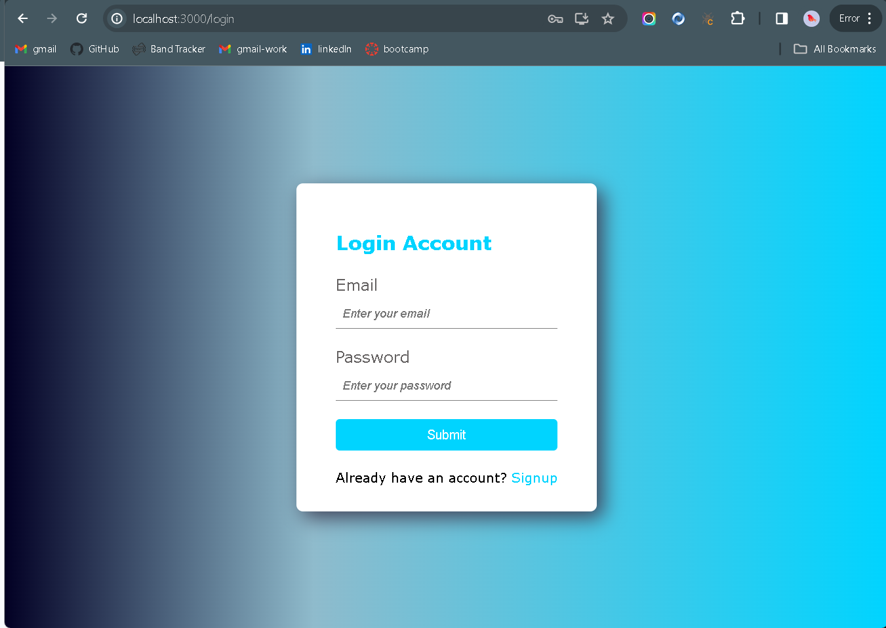

# Login Template

## Table of Contents
1. [Description](#description)
2. [Visuals](#visuals)
3. [Resources](#resources)

## Description

I followed the tutorial provided by Free Code Camp to create a basic JWT-Based login site to use as a template for future projects. I chose to do this to deepen my knowledge of jwt tokens, as I utilize them often in my day to day work. 

I only made slight changes to the existing code samples given in the tutorial.

I hope to further customize this template as time allows. For now, I will use this knowledge and setup to make it easier to start new projects in my free time.

## Visuals

## Resources

[Free Code Camp Tutorial](https://www.freecodecamp.org/news/how-to-secure-your-mern-stack-application/)
